# Annotation Tools
List of annotation tools that aid in the process of manual event, entity and relation annotations.

## Table Of Contents
- [Coreference Annotation Tools](#coreference-annotation-tools)
    - [CorefAnnotator](#corefannotator)
    - [CoRefi](#corefi)
    - [CROMER](#cromer)
    - [SACR](#sacr)
- [Tempral Annotation Tools](#tempral-annotation-tools)
    - [Tango](#tango)
    - [TARSQI Toolkit](#tarsqi-toolkit)
- [General Purpose Annotation Tools](#general-purpose-annotation-tools)
    - [AnnIE](#annie)
    - [Apache UIMA](#apache-uima)
    - [BAT](#bat-the-brandeis-annotation-tool)
    - [Brat](#brat)
    - [CAT](#cat)
    - [Glozz](#glozz-annotation-platform)
    - [TAG](#text-annotation-graphs-tag)
    - [WebAnno](#webanno)

******
 
 

# Coreference Annotation Tools

## CorefAnnotator
### Abstract
This poster presents a new tool for the annotation of co-referring entities in texts. While coreference resolution is an established task in computational linguistics (cf. Poesio et al. 2016), the operationalization of this task is tailored to texts prevalent in this ϐield. This holds true for automatization approaches, but also annotation guidelines and annotation tools. The tool we present here has been developed in the context of an annotation project in which literary texts (drama and prose) are annotated with coreferences.

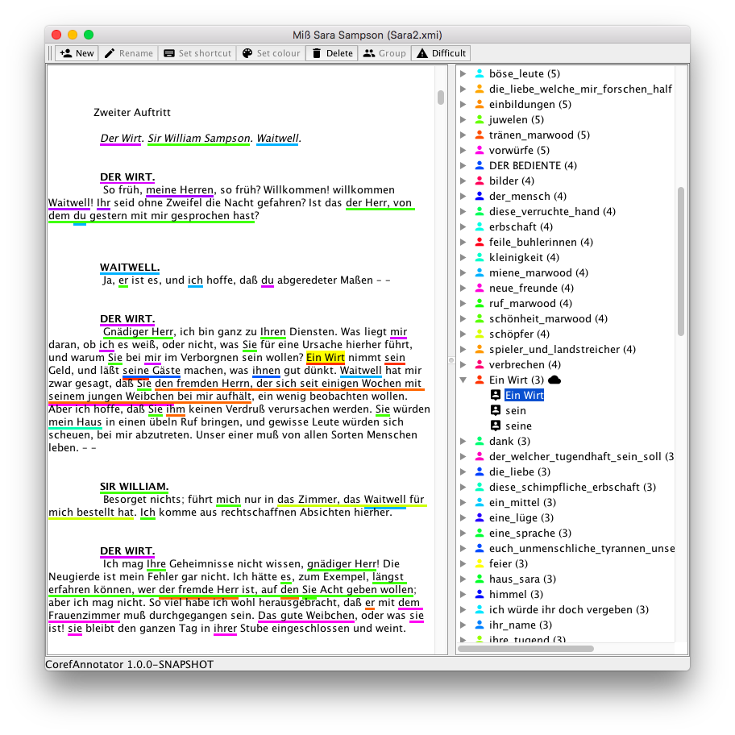

### References
- [Info](https://elib.uni-stuttgart.de/handle/11682/10161)
- [GitHub](https://github.com/nilsreiter/CorefAnnotator)

## CoRefi
### Abstract
Coreference annotation is an important, yet expensive and time consuming, task, which often involved expert annotators trained on complex decision guidelines. To enable cheaper and more efficient annotation, we present CoRefi, a web-based coreference annotation suite, oriented for crowdsourcing. Beyond the core coreference annotation tool, CoRefi provides guided onboarding for the task as well as a novel algorithm for a reviewing phase. CoRefi is open source and directly embeds into any website, including popular crowdsourcing platforms. CoRefi Demo: aka.ms/corefi Video Tour: aka.ms/corefivideo Github Repo: https://github.com/aribornstein/corefi

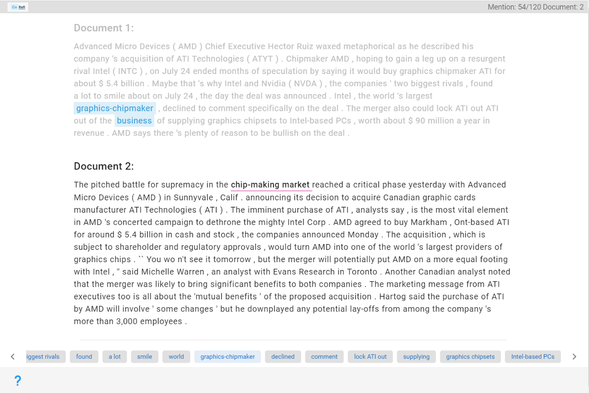

### References
- Paper: [CoRefi: A Crowd Sourcing Suite for Coreference Annotation](https://aclanthology.org/2020.emnlp-demos.27/)
- [GitHub](https://github.com/aribornstein/CoRefi)

## CROMER
### Abstract
In this paper we present CROMER (CROss-document Main Events and entities Recognition), a novel tool to manually annotate event and entity coreference across clusters of documents. The tool has been developed so as to handle large collections of documents, perform collaborative annotation (several annotators can work on the same clusters), and enable the linking of the annotated data to external knowledge sources. Given the availability of semantic information encoded in Semantic Web resources, this tool is designed to support annotators in linking entities and events to DBPedia and Wikipedia, so as to facilitate the automatic retrieval of additional semantic information. In this way, event modelling and chaining is made easy, while guaranteeing the highest interconnection with external resources. For example, the tool can be easily linked to event models such as the Simple Event Model [Van Hage et al , 2011] and the Grounded Annotation Framework [Fokkens et al. 2013].

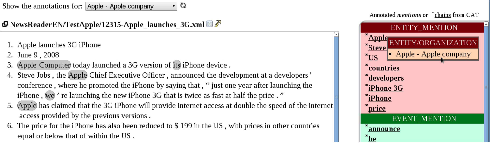

### References
- Paper: [CROMER: a Tool for Cross-Document Event and Entity Coreference](https://aclanthology.org/L14-1568/)
- [GitHub](https://github.com/hltfbk/CROMER/)

## SACR
### Abstract
This paper introduces SACR, an easy-to-use coreference chain annotation tool, which is used to annotate large corpora for Natural Language Processing (NLP) applications. Coreference annotation is usually considered as costly both in terms of time and human resources. So, in order to find the easiest annotation strategy, we will first of all compare several annotation schemes implemented in existing tools. Since interface ergonomics is also an important part of our research, we then focus on identifying the most helpful features to reduce the strain for annotators. In the next section of the paper, we present SACR in details. This tool has been developped specifically for coreference annotation, and its intuitive user interface has been designed to facilitate and speed up the annotation process, making SACR equally suited for students, occasional and non-technical users. In order to create coreference chains, elements are selected by clicking on the corresponding tokens. Coreference relations are then created by drag-and-dropping expressions one over the other. Finally, color frames around marked expressions help the user to visualize both marked expressions and their relations. SACR is open source, distributed under the terms of the Mozilla Public License, version 2.0, and freely available online.

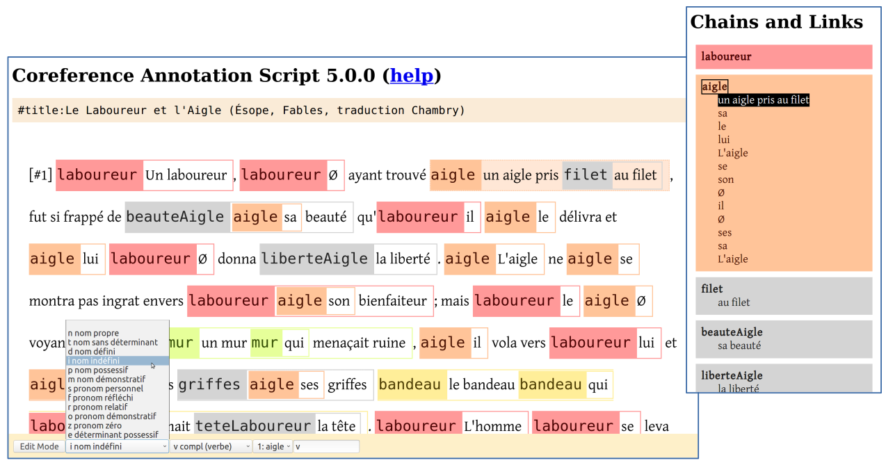

### References
- Paper: [SACR: A Drag-and-Drop Based Tool for Coreference Annotation](https://aclanthology.org/L18-1059/)
- [Webpage](https://boberle.com/projects/coreference-annotation-with-sacr/)

*****
 
 

<!-- Tempral Annotation Tools -->
# Tempral Annotation Tools
## Tango
### Abstract
Temporal annotation is a complex task characterized by low markup speed and low inter-annotator agreements scores. Tango is a graphical annotation tool for temporal relations. It is developed for the TimeML annotation language and allows annotators to build a graph that resembles a timeline. Temporal relations are added by selecting events and drawing labeled arrows between them. Tango is integrated with a temporal closure component and includes features like SmartLink, user prompting and automatic linking of time expressions. Tango has been used to create two corpora with temporal annotation, TimeBank and the AQUAINT Opinion corpus.

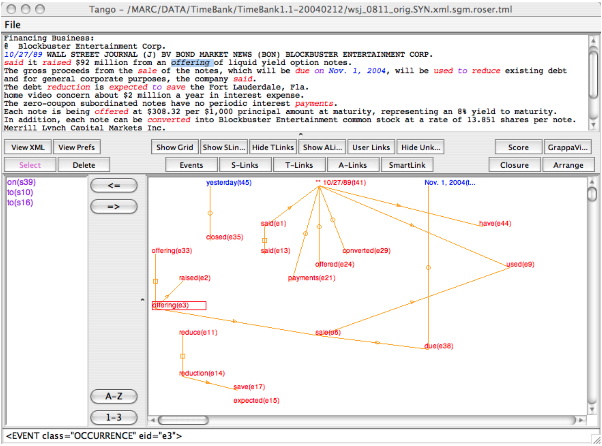

### References
- Paper: [Annotation of Temporal Relations with Tango](https://aclanthology.org/L06-1394/)
- [Webpage](http://timeml.org/tango/)

## TARSQI Toolkit
### Abstract
A modular system for automatic temporal and event annotation of natural language texts. TTK identifies temporal expressions and events in natural language texts, and parses the document to order events and to anchor them to temporal expressions.

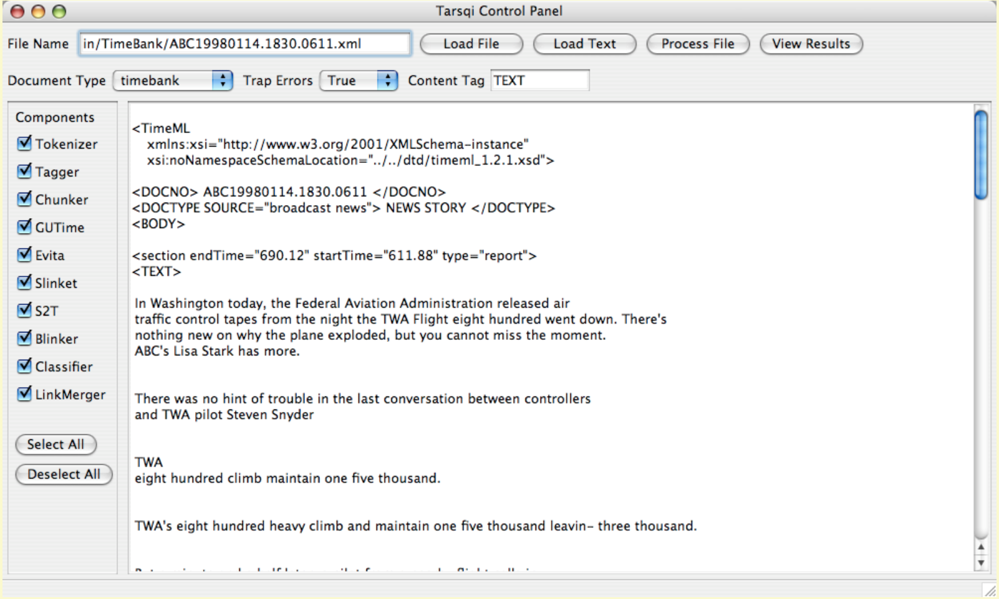

### References
- Paper: [Temporal Processing with the TARSQI Toolkit](https://aclanthology.org/C08-3012/)
- [Webpage](http://timeml.org/site/tarsqi/toolkit/)

<!-- General Purpose Annotation Tools -->
# General Purpose Annotation Tools

## AnnIE
### Abstract
Open Information Extraction (OIE) is the task of extracting facts from sentences in the form of relations and their corresponding arguments in schema-free manner. Intrinsic performance of OIE systems is difficult to measure due to the incompleteness of existing OIE benchmarks: ground truth extractions do not group all acceptable surface realizations of the same fact that can be extracted from a sentence. To measure performance of OIE systems more realistically, it is necessary to manually annotate complete facts (i.e., clusters of all acceptable surface realizations of the same fact) from input sentences. We propose AnnIE: an interactive annotation platform that facilitates such challenging annotation tasks and supports creation of complete fact-oriented OIE evaluation benchmarks. AnnIE is modular and flexible in order to support different use case scenarios (i.e., benchmarks covering different types of facts) and different languages. We use AnnIE to build two complete OIE benchmarks: one with verb-mediated facts and another with facts encompassing named entities. We evaluate several OIE systems on our complete benchmarks created with AnnIE. We publicly release AnnIE (and all gold datasets generated with it) under non-restrictive license.

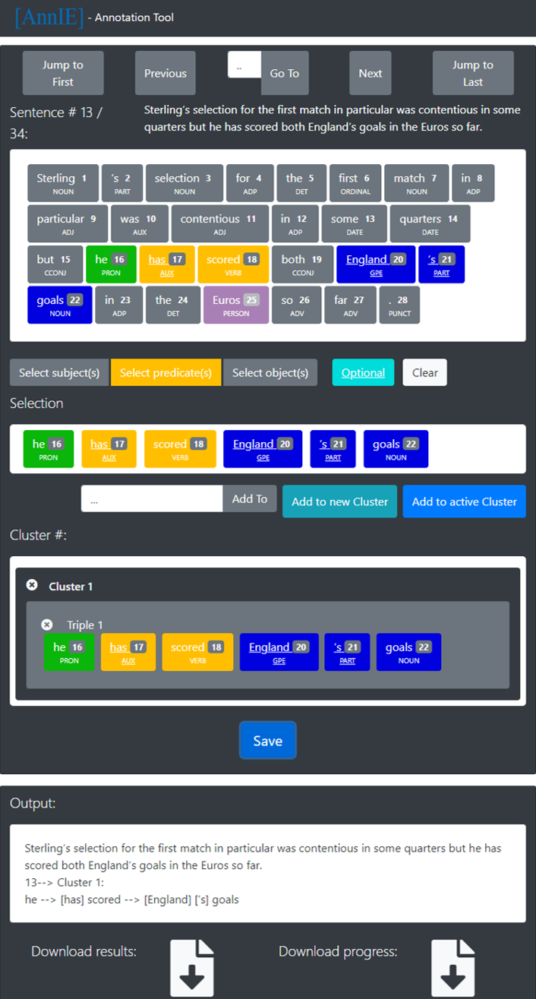

### References
- Paper: [AnnIE: An Annotation Platform for Constructing Complete Open Information Extraction Benchmark](https://aclanthology.org/2022.acl-demo.5/)
- [GitHub](https://github.com/nfriedri/annie-annotation-platform)

## Apache UIMA
Unstructured Information Management applications are software systems that analyze large volumes of unstructured information in order to discover knowledge that is relevant to an end user. An example UIM application might ingest plain text and identify entities, such as persons, places, organizations; or relations, such as works-for or located-at.

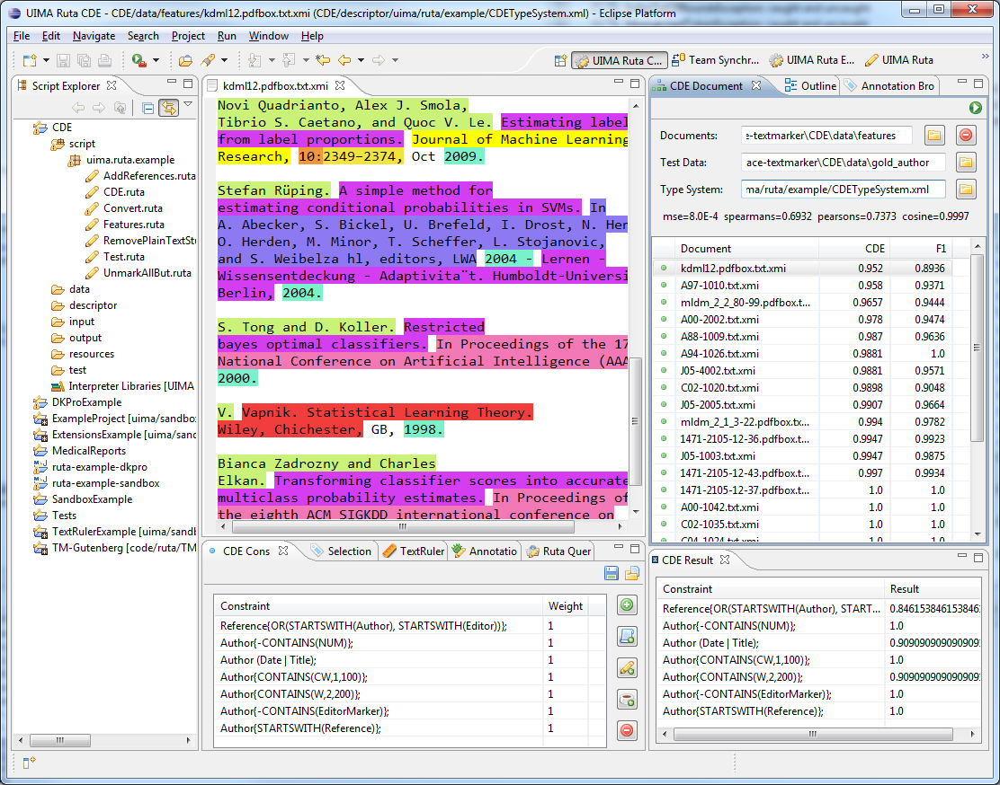

### References
- [Webpage](https://uima.apache.org/index.html)

## BAT (The Brandeis Annotation Tool)
### Abstract
The Brandeis Annotation Tool is a web-based text annotation tool that is centered around the notions of layered annotation and task decomposition. It allows annotations to refer to other annotations and to take a complicated task and split it into easier subtasks. The web-interface connects annotators to a central repository for all data and simplifies many of the housekeeping tasks while keeping requirements at a minimum (that is, users only need an internet connection and a well-behaved browser). BAT has been used mainly for temporal annotation, but can be considered a more general tool for several kinds of textual annotation.

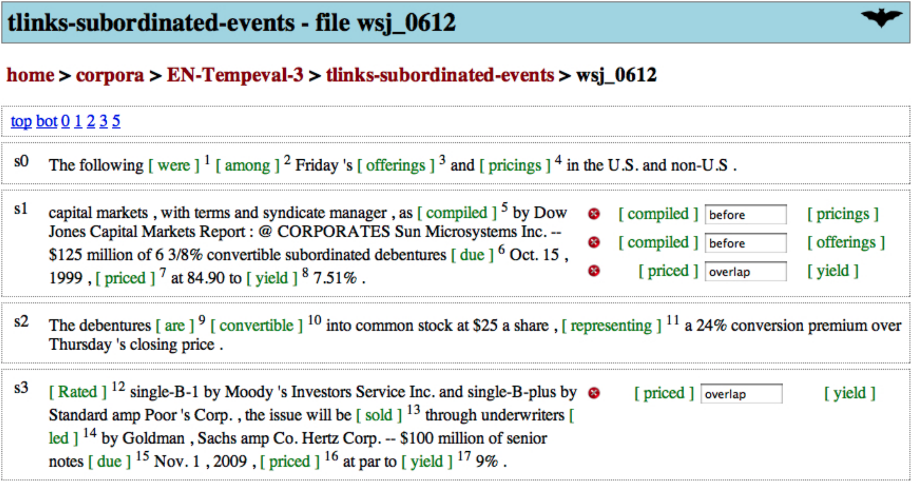

### References
- Paper: [The Brandeis Annotation Tool](https://aclanthology.org/L10-1513/)
- [Webpage (UNAVBL)](http://timeml.org/site/bat/)

## Brat Rapid
### Abstract
We introduce the brat rapid annotation tool (BRAT), an intuitive web-based tool for text annotation supported by Natural Language Processing (NLP) technology. BRAT has been developed for rich structured annotation for a variety of NLP tasks and aims to support manual curation efforts and increase annotator productivity using NLP techniques. We discuss several case studies of real-world annotation projects using pre-release versions of BRAT and present an evaluation of annotation assisted by semantic class disambiguation on a multicategory entity mention annotation task, showing a 15% decrease in total annotation time. BRAT is available under an opensource license from: http://brat.nlplab.org

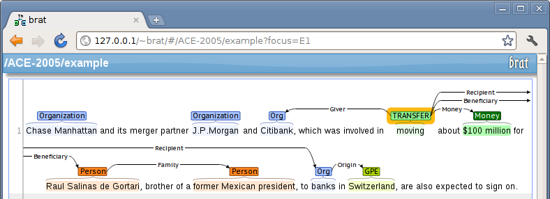

### References
- Paper: [BRAT: a Web-based Tool for NLP-Assisted Text Annotation](https://aclanthology.org/E12-2021/)
- [Webpage](https://brat.nlplab.org/)
- [GitHub](https://github.com/nlplab/brat)

## CAT
### Abstract
This paper presents CAT - CELCT Annotation Tool, a new general-purpose web-based tool for text annotation developed by CELCT (Center for the Evaluation of Language and Communication Technologies). The aim of CAT is to make text annotation an intuitive, easy and fast process. In particular, CAT was created to support human annotators in performing linguistic and semantic text annotation and was designed to improve productivity and reduce time spent on this task. Manual text annotation is, in fact, a time-consuming activity, and conflicts may arise with the strict deadlines annotation projects are frequently subject to. Thanks to its adaptability and user-friendly interface, CAT can positively contribute to improve time management in annotation project. Further, the tool has a number of features which make it an easy-to-use tool for many types of annotations. Even if the first prototype of CAT has been used to perform temporal and event annotation following the It-TimeML specifications, the tool is general enough to be used for annotating a broad range of linguistic and semantic phenomena. CAT is freely available for research purposes.

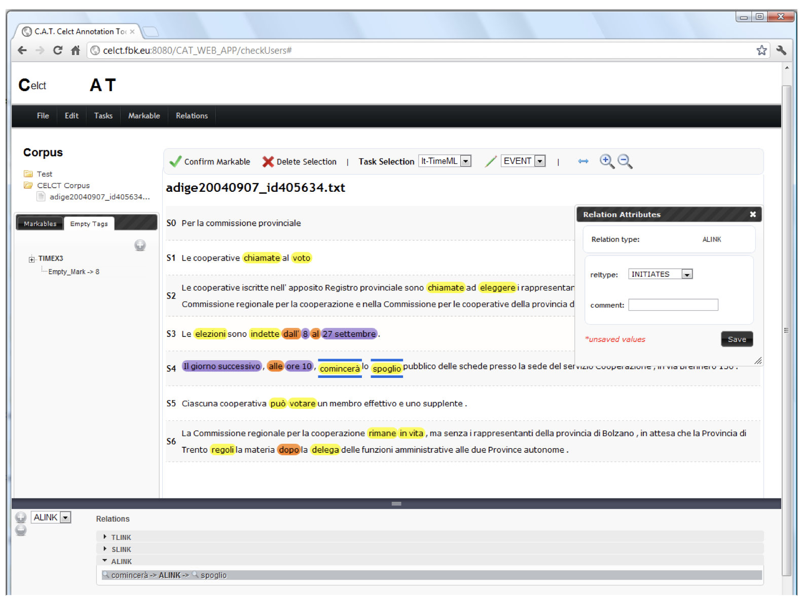

### References
- Paper: [CAT: the CELCT Annotation Tool](https://aclanthology.org/L12-1072/)
- [Webpage](https://dh.fbk.eu/2013/10/cat-content-annotation-tool/)

## Glozz Annotation Platform
### Abstract
Corpus linguistics and Natural Language Processing make it necessary to produce and share reference annotations to which linguistic and computational models can be compared. Creating such resources requires a formal framework supporting description of heterogeneous linguistic objects and structures, appropriate representation formats, and adequate manual annotation tools, making it possible to locate, identify and describe linguistic phenomena in textual documents. The Glozz platform addresses all these needs, and provides a highly versatile corpus annotation tool with advanced visualization, querying and evaluation possibilities.

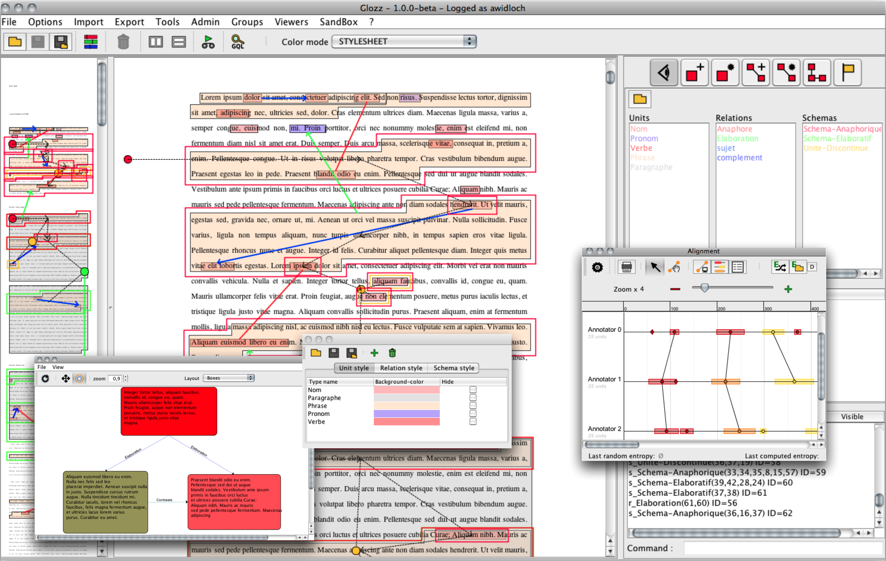

### References
- Paper: [The Glozz platform: a corpus annotation and mining tool](https://dl.acm.org/doi/10.1145/2361354.2361394)
- [Webpage](http://www.glozz.org/)

## Text Annotation Graphs (TAG)
### Abstract
This paper introduces a new web-based software tool for annotating text, Text Annotation Graphs, or TAG. It provides functionality for representing complex relationships between words and word phrases that are not available in other software tools, including the ability to define and visualize relationships between the relationships themselves (semantic hypergraphs). Additionally, we include a visualization mode in which annotation subgraphs, or semantic summaries, are used to show relationships outside of the sequential context of the text itself. These subgraphs can be used to quickly find similar structures within the current document or external annotated documents. TAG was initially developed to support information extraction tasks on a large database of biomedical articles. However, our software is flexible enough to support a wide range of annotation tasks for many domains. Examples are provided that showcase TAG's capabilities on morphological parsing and event extraction tasks.

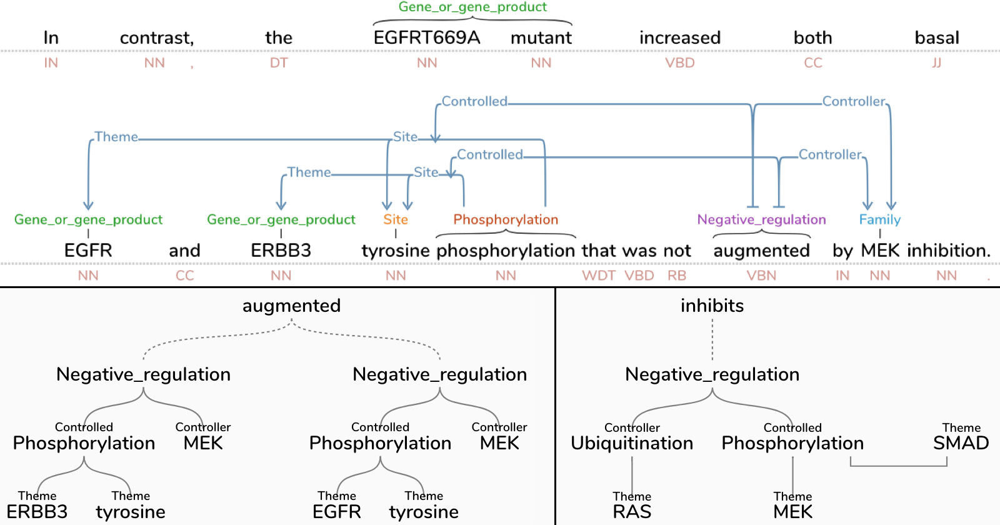

### References
- Paper: [Text Annotation Graphs: Annotating Complex Natural Language Phenomena](https://aclanthology.org/L18-1169/)
- [GitHub](https://github.com/CreativeCodingLab/TextAnnotationGraphs)

## WebAnno
### Abstract
We present WebAnno, a general purpose web-based annotation tool for a wide range of linguistic annotations. WebAnno offers annotation project management, freely configurable tagsets and the management of users in different roles. WebAnno uses modern web technology for visualizing and editing annotations in a web browser. It supports arbitrarily large documents, pluggable import/export filters, the curation of annotations across various users, and an interface to farming out annotations to a crowdsourcing platform. Currently WebAnno allows part-ofspeech, named entity, dependency parsing and co-reference chain annotations. The architecture design allows adding additional modes of visualization and editing, when new kinds of annotations are to be supported.

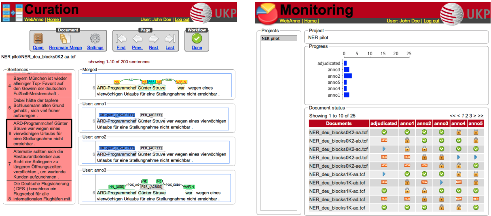

### References
- Paper: [WebAnno: A Flexible, Web-based and Visually Supported System for Distributed Annotations](https://aclanthology.org/P13-4001/)
- [Webpage](https://webanno.github.io/webanno/)