# Annotation Tools  
This page lists annotation tools designed to support the manual/automatic annotation of **events**, **entities**, and **relations** in text. These tools can assist with various tasks, including event detection, coreference resolution, temporal and causal relation labeling, and more.

## Table Of Contents
- [Coreference Annotation Tools](#coreference-annotation-tools)
    - [CorefAnnotator](#corefannotator)
    - [CoRefi](#corefi)
    - [CROMER](#cromer)
    - [SACR](#sacr)
- [Tempral Annotation Tools](#tempral-annotation-tools)
    - [Tango](#tango)
    - [TARSQI Toolkit](#tarsqi-toolkit)
- [General Purpose Annotation Tools](#general-purpose-annotation-tools)
    - [AnnIE](#annie)
    - [Apache UIMA](#apache-uima)
    - [BAT](#bat-the-brandeis-annotation-tool)
    - [Brat](#brat-brat-rapid-annotation-tool)
    - [CAT](#cat-celct-annotation-tool)
    - [Glozz](#glozz-annotation-platform)
    - [GraphAnno](#graphanno)
    - [SenTag](#sentag)
    - [TAG](#text-annotation-graphs-tag)
    - [WebAnno](#webanno)

---

# Coreference Annotation Tools

A list of tools designed to support manual annotation of coreference chains, including both within- and cross-document event/entity coreference.

---

## CorefAnnotator

### Abstract  
CorefAnnotator is a tool for annotating co-referring entities, developed specifically for literary texts such as drama and prose. While coreference resolution is well-studied in computational linguistics (see Poesio et al. 2016), tools are often tailored to specific text types. CorefAnnotator addresses this gap with a user-friendly interface suited for annotating coreference in more diverse genres.

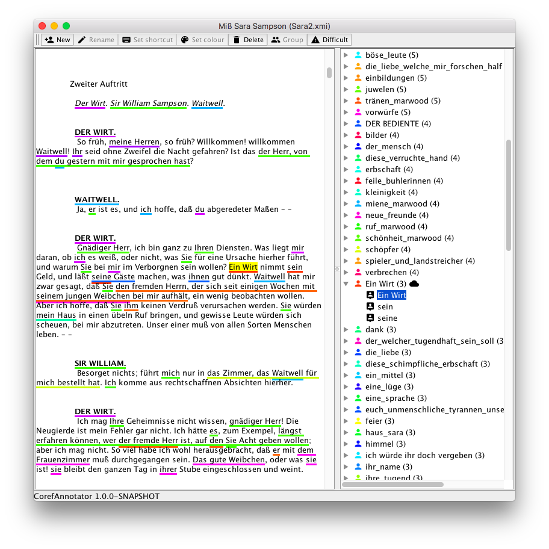

### References  
- [Tool Info](https://elib.uni-stuttgart.de/handle/11682/10161)  
- [GitHub Repository](https://github.com/nilsreiter/CorefAnnotator)

---

## CoRefi

### Abstract  
**CoRefi** is a web-based coreference annotation suite designed for **crowdsourcing**. It aims to reduce the cost and complexity of coreference annotation by providing guided onboarding, a simplified interface, and an integrated review workflow. CoRefi can be embedded into any website, including popular crowdsourcing platforms.

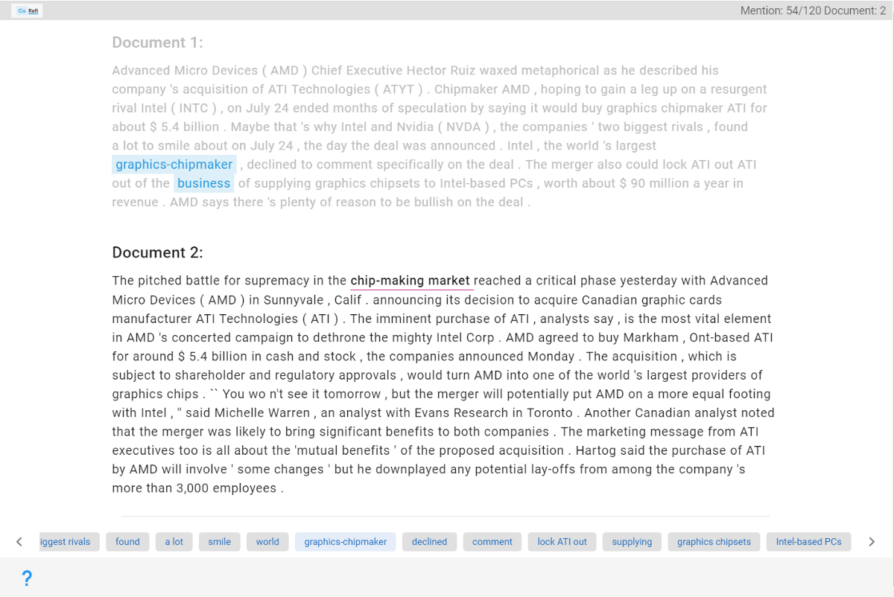

### References  
- Paper: [CoRefi: A Crowd Sourcing Suite for Coreference Annotation](https://aclanthology.org/2020.emnlp-demos.27/)  
- [GitHub Repository](https://github.com/aribornstein/CoRefi)

---

## CROMER

### Abstract  
**CROMER** (CROss-document Main Events and entities Recognition) is a tool for manually annotating **event and entity coreference** across clusters of documents. It supports collaborative annotation, linking to external knowledge bases like **DBpedia** and **Wikipedia**, and integrates with Semantic Web resources such as the **Simple Event Model** and the **Grounded Annotation Framework**.

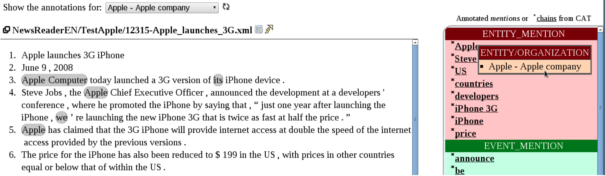

### References  
- Paper: [CROMER: A Tool for Cross-Document Event and Entity Coreference](https://aclanthology.org/L14-1568/)  
- [GitHub Repository](https://github.com/hltfbk/CROMER/)

---

## SACR

### Abstract  
**SACR** is a lightweight, user-friendly tool for creating **coreference chains** through a drag-and-drop interface. Designed to reduce annotation time and fatigue, it allows users to annotate coreference relations by clicking on tokens and dragging one expression over another. Its intuitive design makes it suitable for non-experts, students, and occasional annotators.

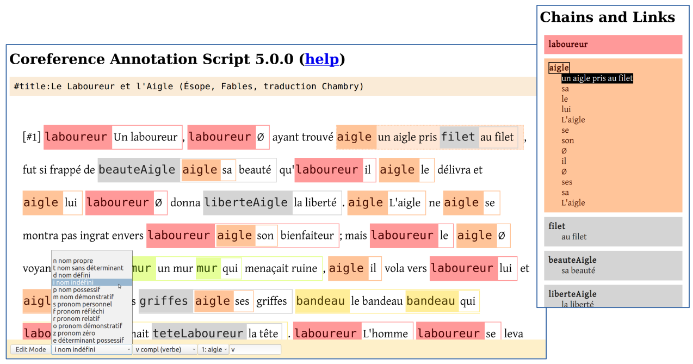

### References  
- Paper: [SACR: A Drag-and-Drop Based Tool for Coreference Annotation](https://aclanthology.org/L18-1059/)  
- [Tool Webpage](https://boberle.com/projects/coreference-annotation-with-sacr/)

---

# Temporal Annotation Tools  

A list of tools designed to support the annotation of **temporal expressions**, **event-event temporal relations**, and **event-time anchoring**. These tools often follow the TimeML standard and support timeline visualization, temporal graph construction, and automated preprocessing.

---

## Tango

### Abstract  
**Tango** is a graphical annotation tool developed for annotating **temporal relations** using the **TimeML** language. Temporal annotation is known to be time-consuming and error-prone, with often low inter-annotator agreement. Tango allows annotators to build timeline-like graphs by drawing labeled arrows between events. It includes features such as **SmartLink**, automatic linking of time expressions, and a temporal closure module.

Tango was used in the creation of the **TimeBank** and **AQUAINT Opinion** corpora.

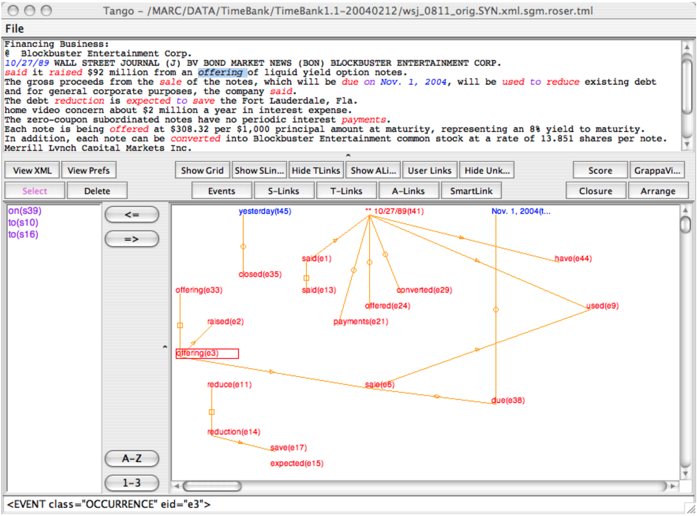

### References  
- Paper: [Annotation of Temporal Relations with Tango](https://aclanthology.org/L06-1394/)  
- [Tool Webpage](http://timeml.org/tango/)

---

## TARSQI Toolkit

### Abstract  
The **TARSQI Toolkit (TTK)** is a modular system for the **automatic annotation** of temporal expressions and event-time relations in natural language texts. It identifies temporal expressions and events, determines their temporal ordering, and anchors events to time expressions. TTK is frequently used for preprocessing and pipeline integration in TimeML-based workflows.

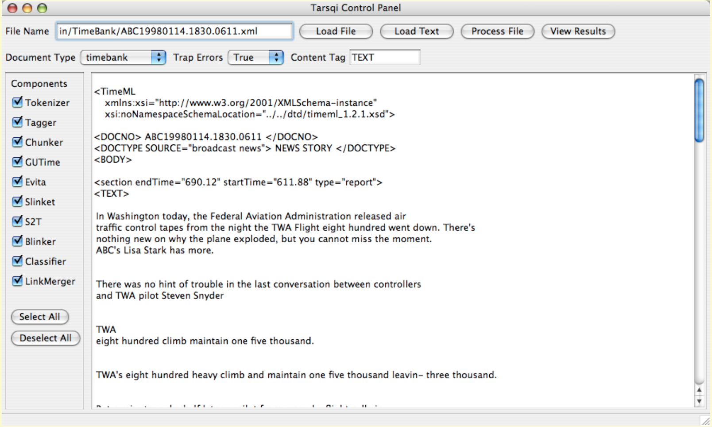

### References  
- Paper: [Temporal Processing with the TARSQI Toolkit](https://aclanthology.org/C08-3012/)  
- [Toolkit Webpage](http://timeml.org/site/tarsqi/toolkit/)

---

<!-- General Purpose Annotation Tools -->
# General Purpose Annotation Tools

A collection of versatile annotation tools that support a wide range of NLP tasks, including entity, event, relation, and fact extraction. These tools are not limited to specific annotation types and are often extensible or designed for layered and modular annotation workflows.

---

## AnnIE

### Abstract  
**AnnIE** is an interactive annotation platform for creating **complete Open Information Extraction (OIE) benchmarks**. It supports annotation of full factual content by grouping multiple acceptable surface realizations of the same fact. AnnIE is modular, multilingual, and designed to support diverse use cases, including verb-mediated and named entity-based facts. It has been used to build two gold-standard OIE benchmarks and is released under a non-restrictive license.

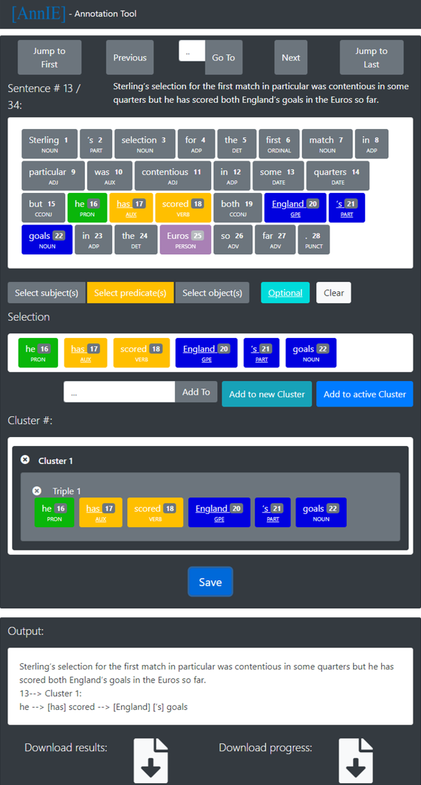

### References  
- Paper: [AnnIE: An Annotation Platform for Constructing Complete Open Information Extraction Benchmark](https://aclanthology.org/2022.acl-demo.5/)  
- [GitHub Repository](https://github.com/nfriedri/annie-annotation-platform)

---

## Apache UIMA

### Abstract  
**Apache UIMA** (Unstructured Information Management Architecture) is a framework for building software systems that analyze large volumes of **unstructured data**, such as text. UIMA applications can extract entities (e.g., people, places, organizations) and relations (e.g., *works-for*, *located-at*), and are often used as backbones for complex annotation pipelines.

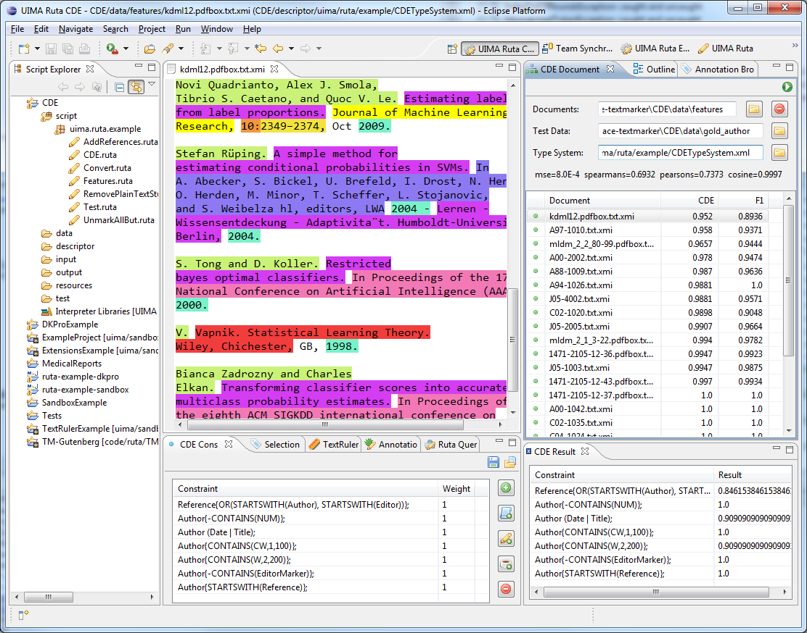

### References  
- [Official Webpage](https://uima.apache.org/index.html)

---

## BAT (The Brandeis Annotation Tool)

### Abstract  
**BAT** is a web-based annotation platform focused on **layered annotation** and **task decomposition**. It allows annotations to refer to other annotations, making it ideal for complex or multi-step tasks. It is lightweight, requiring only a web browser, and connects to a central data repository. BAT has been used primarily for **temporal annotation**, but is flexible enough for general-purpose text annotation.

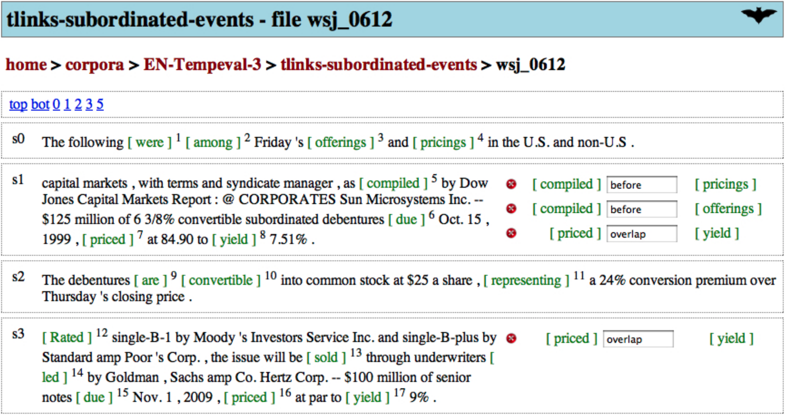

### References  
- Paper: [The Brandeis Annotation Tool](https://aclanthology.org/L10-1513/)  
- [Tool Webpage (Archived)](http://timeml.org/site/bat/)

---

## brat (brat rapid annotation tool)

### Abstract  
**brat** is a widely-used, web-based tool for rich structured text annotation. Designed with an intuitive interface and NLP-assisted features, it supports a variety of tasks including **entity recognition**, **event annotation**, and **relation extraction**. brat is optimized for productivity, offering features such as semantic class disambiguation and pre-annotation integration. It is open-source and used in many real-world annotation projects.

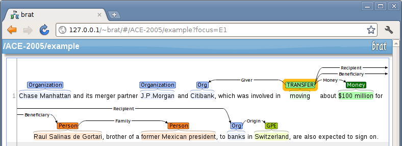

### References  
- Paper: [brat: a Web-based Tool for NLP-Assisted Text Annotation](https://aclanthology.org/E12-2021/)  
- [Official Webpage](https://brat.nlplab.org/)  
- [GitHub Repository](https://github.com/nlplab/brat)

---

## CAT (CELCT Annotation Tool)

### Abstract  
**CAT** is a general-purpose, web-based annotation tool developed by CELCT to make **linguistic and semantic annotation** more intuitive and efficient. Originally created for annotating temporal and event information following It-TimeML guidelines, CAT is highly adaptable and suitable for a broad range of annotation tasks. Its user-friendly interface helps reduce annotation time and improve productivity, especially in time-constrained projects.

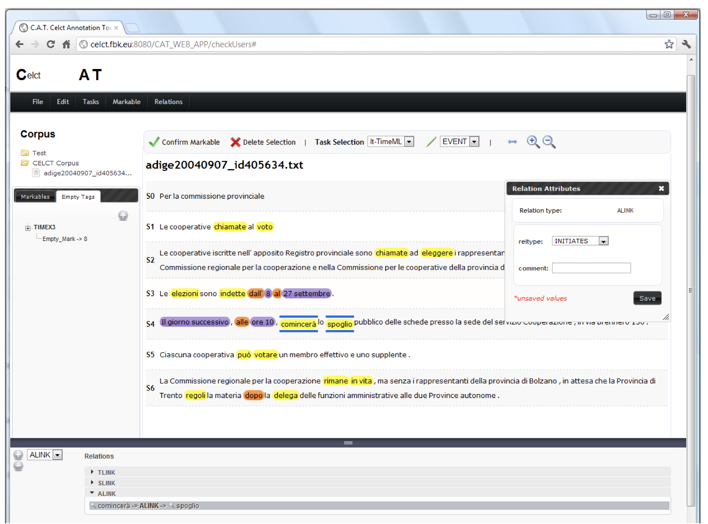

### References  
- Paper: [CAT: the CELCT Annotation Tool](https://aclanthology.org/L12-1072/)  
- [Tool Webpage](https://dh.fbk.eu/2013/10/cat-content-annotation-tool/)

---

## Glozz Annotation Platform

### Abstract  
**Glozz** is a comprehensive corpus annotation platform supporting the description and visualization of **heterogeneous linguistic objects** and **complex structures**. It includes tools for visualization, querying, and evaluation, making it suitable for both **manual annotation** and corpus mining.

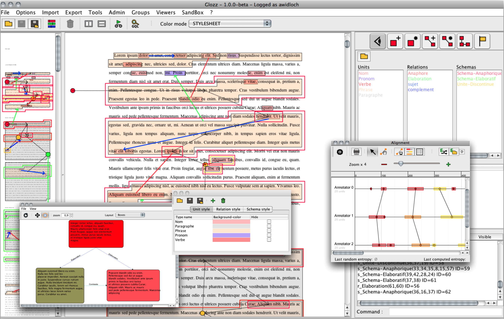

### References  
- Paper: [The Glozz Platform: A Corpus Annotation and Mining Tool](https://dl.acm.org/doi/10.1145/2361354.2361394)  
- [Tool Webpage](http://www.glozz.org/)

---

## GraphAnno

### Abstract  
**GraphAnno** is a configurable, lightweight tool for **multi-level linguistic annotation**. It supports the full workflow from corpus import to export and is particularly suited for **semantic annotation**, such as modal verbs and scope interactions. Its flexible design allows integration with various annotation schemes and use cases.

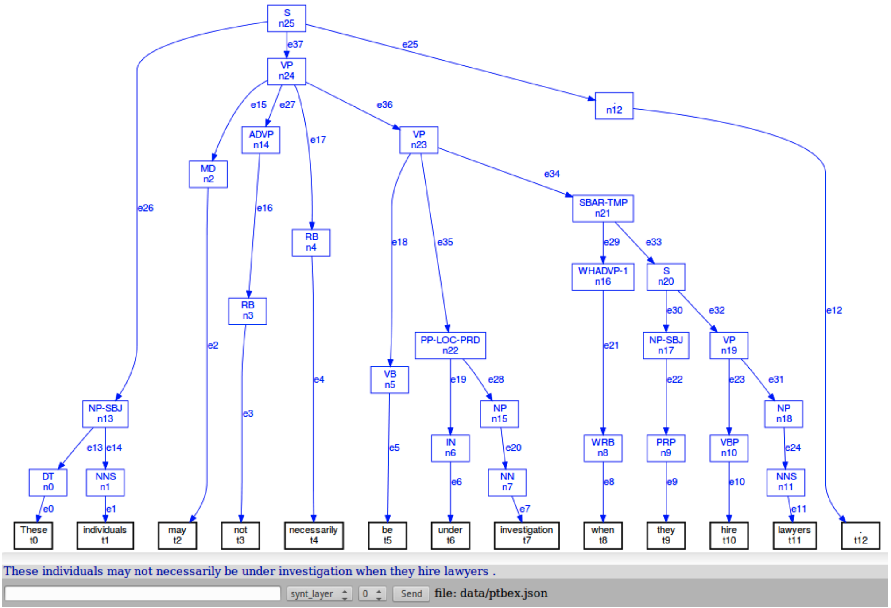

### References  
- Paper: [Annotating Modals with GraphAnno, a Configurable Lightweight Tool for Multi-level Annotation](https://aclanthology.org/W15-0303/)  
- [GitHub Repository](https://github.com/LBierkandt/graph-anno/)

---

## SenTag

### Abstract  
**SenTag** is a lightweight, web-based platform for **semantic annotation**. It supports collaborative annotation, XML export, and argument graph construction. Its intuitive interface is designed to reduce annotation errors and facilitate inter-annotator agreement evaluation.

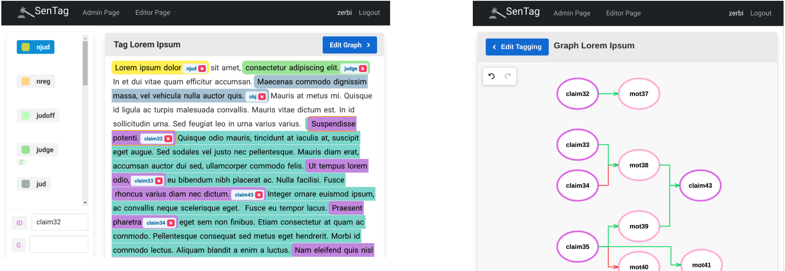

### References  
- Paper: [SenTag: A Web-based Tool for Semantic Annotation of Textual Documents](https://ojs.aaai.org/index.php/AAAI/article/view/21724/21473)  
- [GitHub Repository](https://github.com/AlbertoZerbinati/sentag)

---

## Text Annotation Graphs (TAG)

### Abstract  
**TAG** is a web-based tool for annotating complex relationships in text, including **semantic hypergraphs** and **meta-relations** (relations between relations). Originally developed for biomedical text processing, TAG is flexible enough to support a wide range of annotation tasks including **event extraction**, **morphological parsing**, and **semantic summarization**.

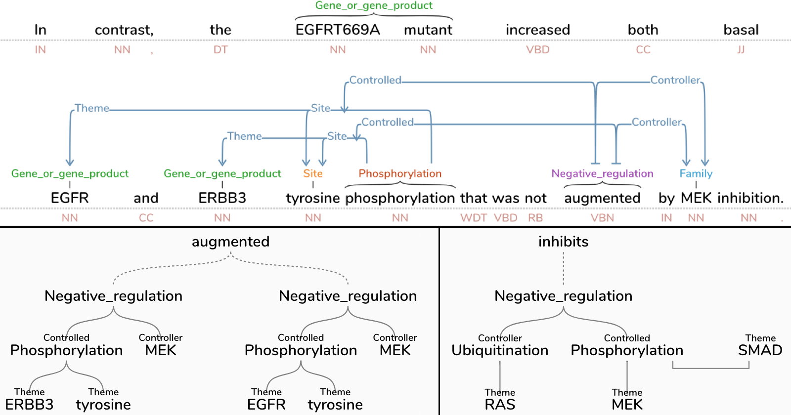

### References  
- Paper: [Text Annotation Graphs: Annotating Complex Natural Language Phenomena](https://aclanthology.org/L18-1169/)  
- [GitHub Repository](https://github.com/CreativeCodingLab/TextAnnotationGraphs)

---

## WebAnno

### Abstract  
**WebAnno** is a powerful and extensible web-based tool for **distributed linguistic annotation**. It supports project and user management, configurable tagsets, large documents, and multiple annotation layers including **POS tagging**, **NER**, **dependency parsing**, and **coreference resolution**. WebAnno also integrates with crowdsourcing platforms and allows for collaborative annotation curation.

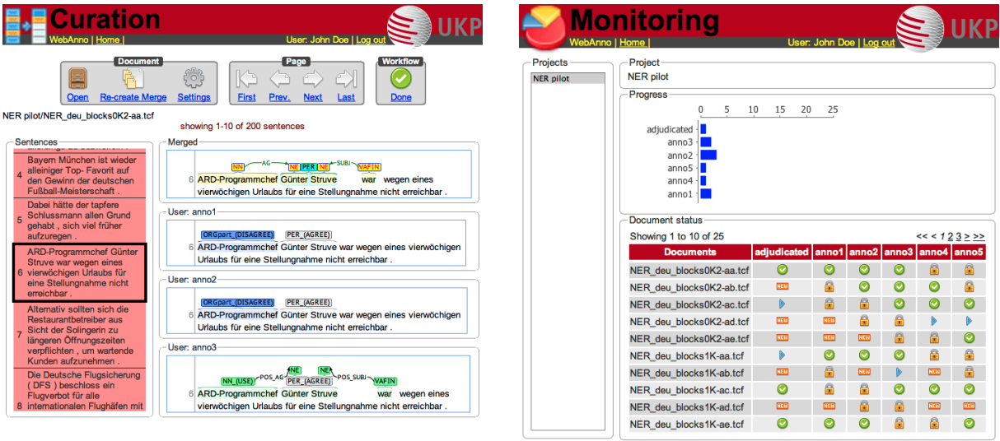

### References  
- Paper: [WebAnno: A Flexible, Web-based and Visually Supported System for Distributed Annotations](https://aclanthology.org/P13-4001/)  
- [Official Webpage](https://webanno.github.io/webanno/)
